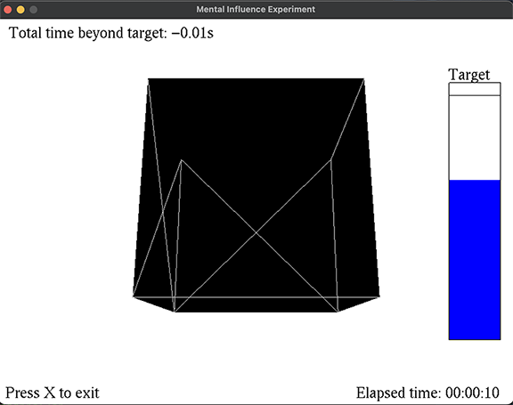

# quantum_influence
An experiment to measure impact of intention on quantum random numbers

## Summary

Uses USB Mind-Enabled Devices (MED) from Core Invention as the QRNG source.

## Setup (assuming OS X)

1. Install MySQL database\
    ```$ brew install mysql```
1. Run MySQL\
    ```$ mysqld&```
1. Connect to MySQL\
    ```% mysql -u root```
1. Create the database\
    ```mysql> create database myDatabase;```\
    ```mysql> \q```
1. Populate and run in terminal\
    ```$ export MYSQL_USER=root```\
    ```$ export MYSQL_PASSWORD=```\
    ```$ export MYSQL_HOST=localhost```\
    ```$ export MYSQL_DB=myDatabase```
1. Goto folder and create tables\
    ```$ cd quantum_influence/med100kx8```\
    ```$ mysql -u root myDatabase < db_setup.sql```
1. Install Python module\
    ```$ pip3 install -r requirements.txt```
1. Set your MED's serial number in run\main.py#33\
    ```serial_number = "QWR4E001"  # Replace with your serial number```

## Running
``` cd \run```\
```$ python3 main.py```\

